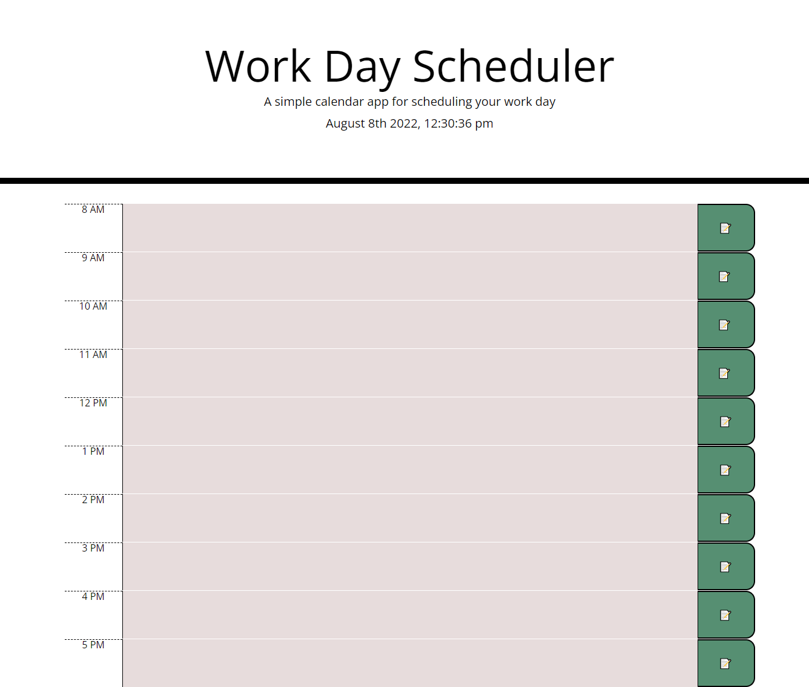

# Week5_WorkDaySchedulerChallenge_MB
Week 5 Work Day Scheduler

Week 5 - Work Day Scheduler submission by Marian Nicole Borja 

Project Overview
---------------------
Students were given starter code. Students were tasked with creating a functional work day planner. 

Table of Contents
1. Acceptance Criteria
2. Deployed Image
3. Process

Acceptance Criteria
-----------------------
In order to complete this task, students were asked to create a scheduler that does the following:

- GIVEN I am using a daily planner to create a schedule
- WHEN I open the planner
- THEN the current day is displayed at the top of the calendar
- WHEN I scroll down
- THEN I am presented with timeblocks for standard business hours
- WHEN I view the timeblocks for that day
- THEN each timeblock is color coded to indicate whether it is in the past, present, or future
- WHEN I click into a timeblock
- THEN I can enter an event
- WHEN I click the save button for that timeblock
- THEN the text for that event is saved in local storage
- WHEN I refresh the page
- THEN the saved events persist

Deployed Image
-----------------------

Process
-----------------------

Student did the following to achieve requested results.
- Utilized Moments to provide time functionality to scheduler
- Utilized CSS to stylize planner
- Used Javascript to ensure input gets saved to Local Storage 

Contributions
-----------------------
https://momentjs.com/

Contributer Marian "Nicole" Borja
August 2022
